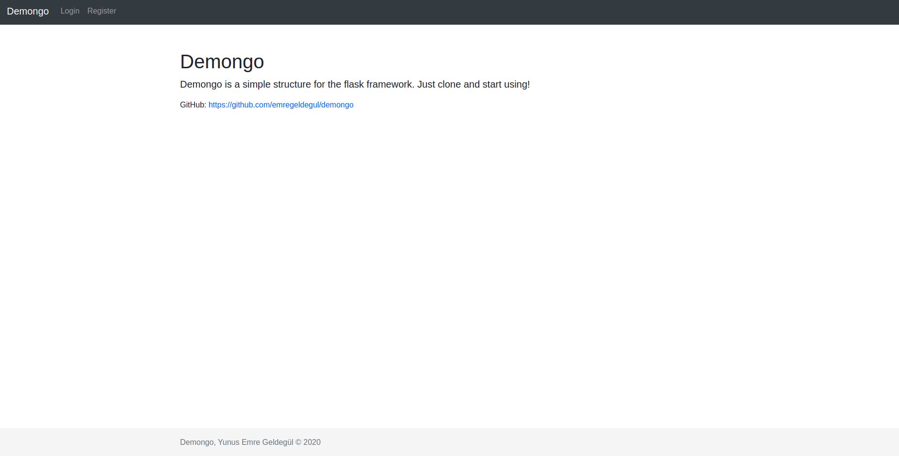

# Demongo
Demongo is a simple structure for the flask framework. Just clone and start using!

## Setup
```bash
~$ git clone https://github.com/emregeldegul/demongo.git && cd demongo
~$ python3 -m virtualenv venv && source venv/bin/activate
~$ pip install -r requirements.txt
~$ touch >> settings_local.py
~$ flask db migrate -m 'create struct'
~$ flask db upgrade
~$ flask run
```

## Clear Commit History

You may want to clear your GIT history after making improvements after the initial setup. Follow the steps below.

```bash
~$ git checkout --orphan tmp
~$ git add -A
~$ git commit -am "first commit"
~$ git branch -D master
~$ git branch -m master
```

## Add Yourself Routes
You can add a file in `app/routes` folder and create yourself blueprint app.

Example for order blueprint:

`app/routes/order.py`

```python
from flask import Blueprint, render_template

order = Blueprint('order', __name__, url_prefix='/order')


@order.route('/')
def index():
    return render_template('views/order/index.html', title='Order')
```

## Base Model
You can use inside `app/models/abstract.py` in `BaseModel` as the base model.

`app/models/order.py`

```python
from app.models.abstract import BaseModel


class Order(BaseModel):
    id = db.Column(db.Integer, primary_key=True)
    number = db.Column(db.String(50), nullable=False, unique=True)
    ...

    def __repr__(self):
        return "Order({})".format(self.number)
```

It will automatically create the creation and update columns for you and add the save method.

## Screenshots
